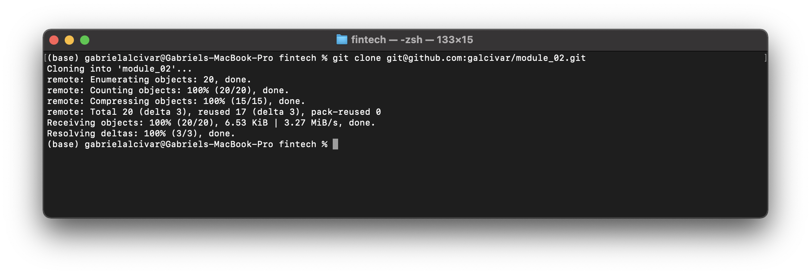

# Loan Qualifier App
Software that prompts the user to save the qualifying loans as a new CSV file based on the user data. Takes into account solicitants data:
- Credit Score
- Current Monthly Debt
- Total Monthly Income
- Desired Loan Amount
- Home Value

*It saves the data in a csv file with the name the user requests.*

#### Acceptance Criteria
- Given that I’m using the loan qualifier CLI, when I run the qualifier, then the tool should prompt the user to save the results as a CSV file.
- Given that no qualifying loans exist, when prompting a user to save a file, then the program should notify the user and exit.
- Given that I have a list of qualifying loans, when I’m prompted to save the results, then I should be able to opt out of saving the file.
- Given that I have a list of qualifying loans, when I choose to save the loans, the tool should prompt for a file path to save the file.
- Given that I’m using the loan qualifier CLI, when I choose to save the loans, then the tool should save the results as a CSV file.

---

## Technologies
*Developed in Python and tested on MacOS.*
It requires to have the following installed (Versions tested):
- Python 3.9.7
- Fire 0.3.1
- Questionary 1.5.2
- Path
- csv
- sys

---

## Installation Guide
1. Clone this project using git with the following command: `git clone git@github.com:galcivar/module_02.git`

2. Install Python you should follow this instructions depending on you OS: https://realpython.com/installing-python/
3. Install the required packages:
`pip install fire==0.3.1`

`pip install questionary==1.5.2`

---

## Usage
You can use this program by navigating to the folder of the project (where app.py is) and run:
`python app.py`

---

## Contributors
Gabriel Alcivar
[Email](mailto:galcivar@galgomedia.com) - [LinkedIn](https://www.linkedin.com/in/gabriel-alcivar-aa83a710b/) - [GitHub](https://github.com/galcivar/)

---

## MIT License

Copyright (c) [2022] [Gabriel Alcivar]

Permission is hereby granted, free of charge, to any person obtaining a copy
of this software and associated documentation files (the "Software"), to deal
in the Software without restriction, including without limitation the rights
to use, copy, modify, merge, publish, distribute, sublicense, and/or sell
copies of the Software, and to permit persons to whom the Software is
furnished to do so, subject to the following conditions:

The above copyright notice and this permission notice shall be included in all
copies or substantial portions of the Software.

THE SOFTWARE IS PROVIDED "AS IS", WITHOUT WARRANTY OF ANY KIND, EXPRESS OR
IMPLIED, INCLUDING BUT NOT LIMITED TO THE WARRANTIES OF MERCHANTABILITY,
FITNESS FOR A PARTICULAR PURPOSE AND NONINFRINGEMENT. IN NO EVENT SHALL THE
AUTHORS OR COPYRIGHT HOLDERS BE LIABLE FOR ANY CLAIM, DAMAGES OR OTHER
LIABILITY, WHETHER IN AN ACTION OF CONTRACT, TORT OR OTHERWISE, ARISING FROM,
OUT OF OR IN CONNECTION WITH THE SOFTWARE OR THE USE OR OTHER DEALINGS IN THE
SOFTWARE.
